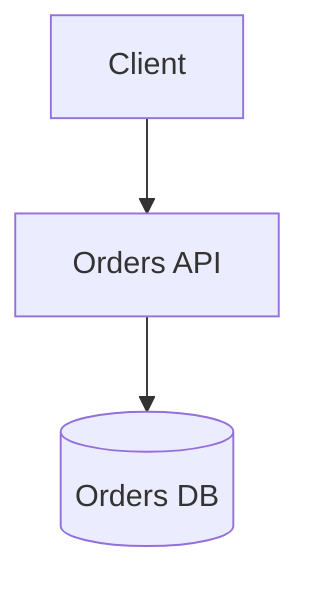
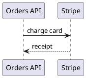

# Orders design

Some prose about the service.

## Request flow


```mermaid
graph TD
  client[Client] --> api[Orders API]
  api --> db[(Orders DB)]
```

## Payment sequence


```plantuml
@startuml
participant "Orders API" as api
participant Stripe
api -> Stripe : charge card
Stripe --> api : receipt
@enduml
```

```js
console.log('not a diagram');
```
